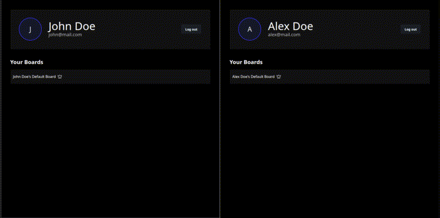

# Fullstack Trello Clone

### Overview

This project is a full-stack Trello clone which is a real-time collaborative task board.

### Features

- User authentication and authorization
- Board, columns and cards management
- Real-time updates using WebSockets
- Drag and drop functionality for cards and columns
- Inviting other users to boards

### Tech Stack

-  **PostgreSQL** is used as the db
-  **Docker** is used for containerization
-   **Java** with **Spring Boot** is used for the backend
-  **WebSocket** is used for real-time communication
-   **OpenAPI** and **Swagger** are used for API documentation
-   **OpenAPI Typescript** is used for generating TypeScript types from the OpenAPI specification
-   **React** with **Typescript** is used for the frontend
-  **TailwindCSS** with a UI library is used for styling

### Installation & Usage
